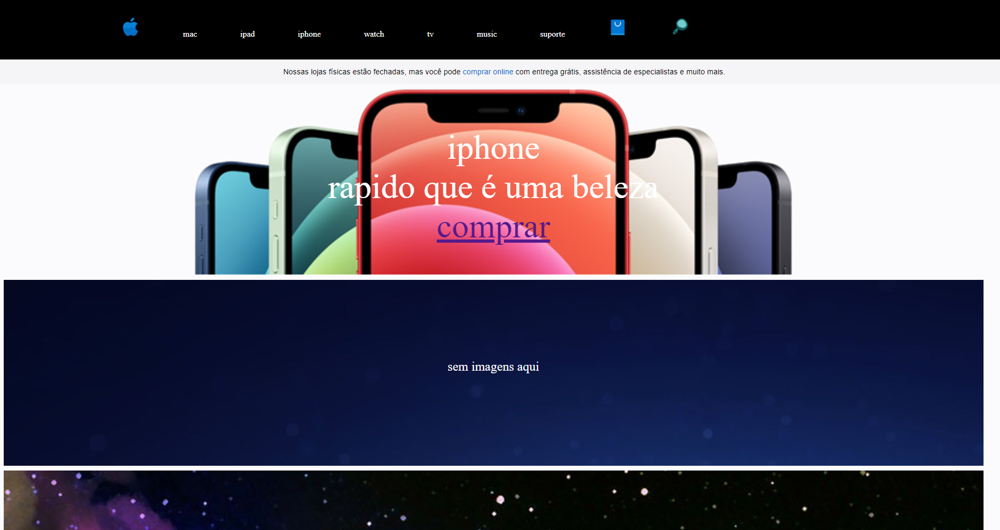
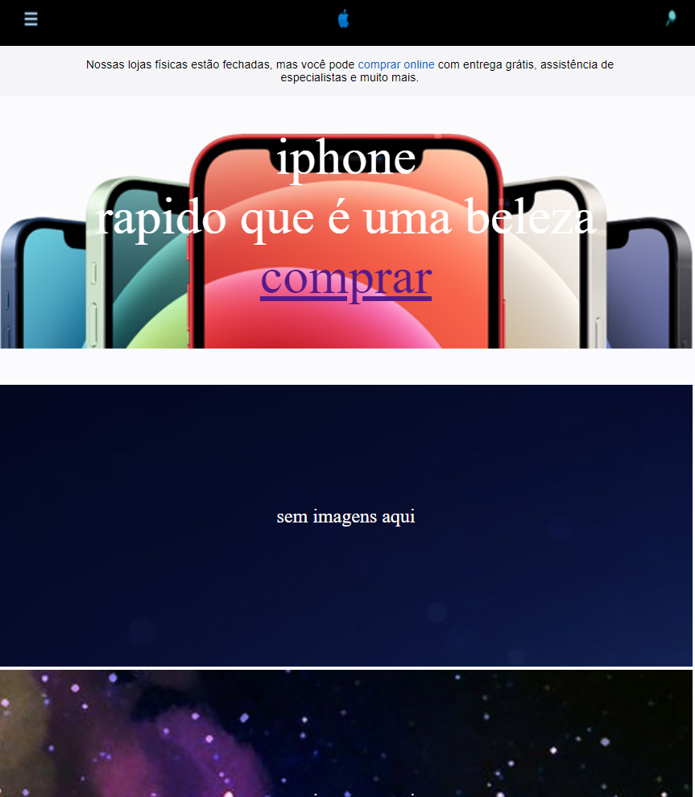

# site Clone Apple

<a href="https://vilmar-moreira-souza.github.io/siteCloneApple/" target="blank">visualizar</a>
<h2>desktop</h2>

<h2>mobile</h2>

<h3>sobre a aplicação</h3>

essa aplicação é um clone da página inicial da appe brasil, no formato responsivo. 

 <a href="https://www.apple.com/br/ " target="blank"> site clonado</a>
 <a href="https://vilmar-moreira-souza.github.io/siteCloneApple/" target="blank">visualizar clone</a>
 

<h3>ideias para implementar</h3>

 <li>melhorar o design</li>
<li> adicionar imagens e icones com melhore resoluçoes e formatos mais adequados</li>
<li> adicionar links da pagina que não existem</li>
<li> mais...</li>

<h3>bugs e problemas</h3>
<li>melhora responsividade do footer</li>
<li>melhorar css- deixar codigo mais enxuto  </li>
<li> mais...</li>
